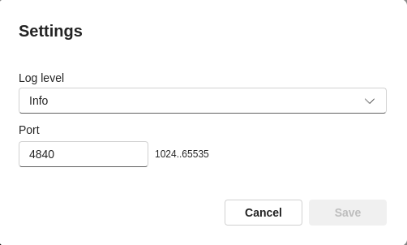
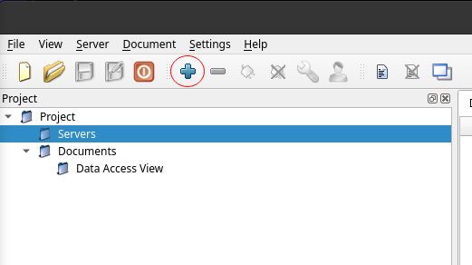
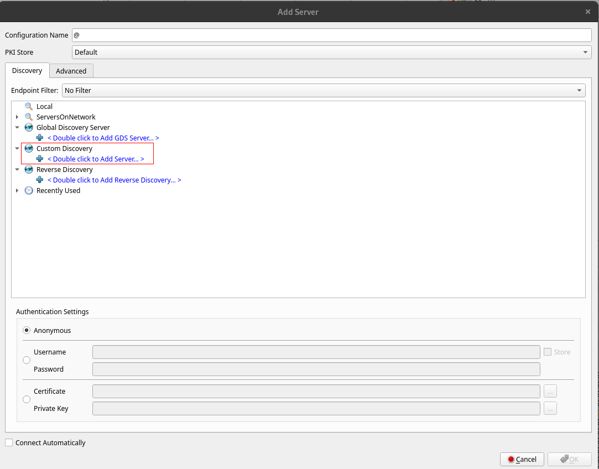
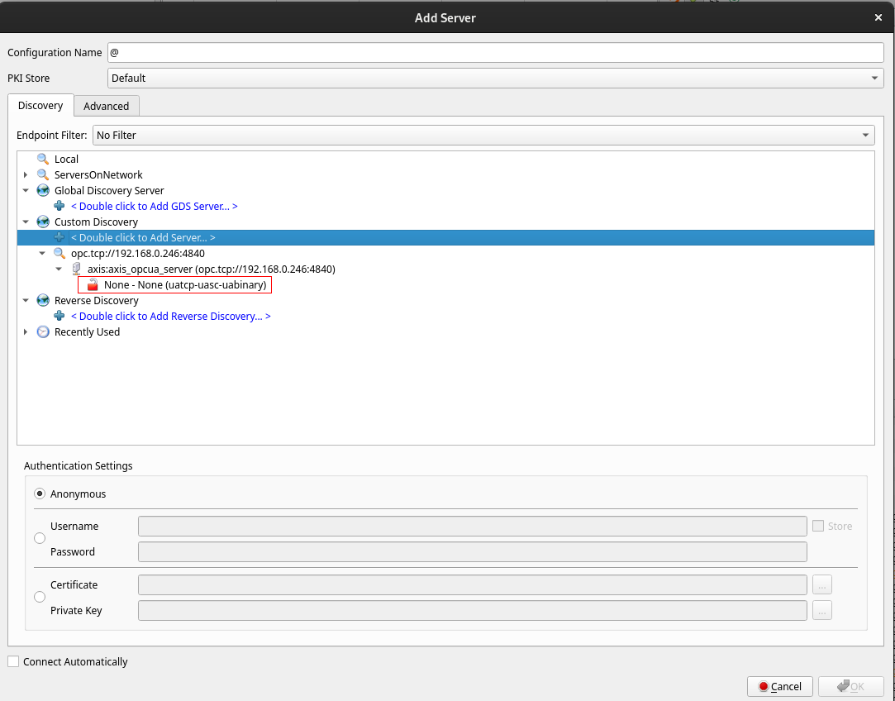
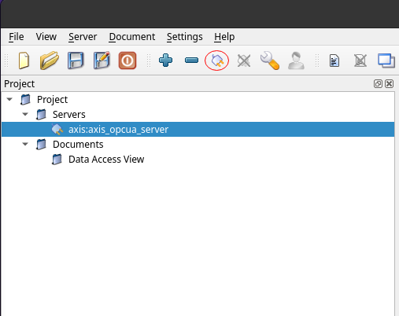
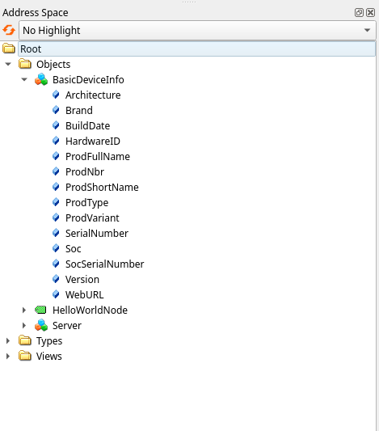

*©2025 Axis Communications AB. AXIS COMMUNICATIONS, AXIS, ARTPEC and VAPIX are registered trademarks of Axis AB in various jurisdictions. All other trademarks are the property of their respective owners.*

<!-- omit in toc -->
# OPC-UA Plugin Server ACAP application

This repository contains the source code for building an OPC-UA Server ACAP application,
along with a guide on developing and building custom modules/plugins. You can
create your own plugins to address specific use cases. Two example plugins
are provided and described below. Additional plugins will be published in
the future designed to enhance production value.

The OPC-UA Server is based on the [**open62541**](https://www.open62541.org/)
library. For an introduction to OPC-UA, see
[**OPC Foundation**](https://opcfoundation.org/).

<!-- omit in toc -->
## Table of contents

- [Products and device software](#products-and-device-software)
- [Build the application](#build-the-application)
    - [Make and Docker](#make-and-docker)
    - [Docker](#docker)
    - [Docker (development containers)](#docker-development-containers)
- [Install and setup](#install-and-setup)
    - [Install](#install)
    - [Setup](#setup)
    - [Usage](#usage)
- [Create your own plugin](#create-your-own-plugin)
- [Limitations](#limitations)
    - [Security](#security)
    - [Certification](#certification)
- [License](#license)

## Products and device software

The application has been tested on the following products (with firmware version):

- AXIS Q1645 - 11.7.61
- AXIS F9111 - 12.2.58
- AXIS P3265-LV - 12.0.4
- AXIS Q1961-TE - 12.0.10

>[!NOTE]
> The application may work on other Axis devices and firmware versions beyond those
> listed, but compatibility is not guaranteed. Users are advised to test the
> application on their specific device and firmware version before deploying it in
> production. For more information on compatibility, please visit the
> [**Axis Developer Documentation**](https://developer.axis.com/acap/axis-devices-and-compatibility/).

## Build the application

### Make and docker

```sh
make dockerbuild
```

This will build the application (server and all plugins) for both supported
architectures: armv7hf and aarch64.

### Docker

Alternatively, you can build the application for each architecture using the following
commands without invoking `make`:

```sh
# 32-bit ARM, e.g. ARTPEC-6- and ARTPEC-7-based devices
docker build --build-arg ARCH=armv7hf --output type=local,dest=. .

# 64-bit ARM, e.g. ARTPEC-8-based devices
docker build --build-arg ARCH=aarch64 --output type=local,dest=. .
```

Upon successful build, the application (`.eap` file) will be located in the main directory (`opc-ua-plugin-server/`).

### Docker (development containers)

If you want to start developing your own version of the application or to customize the
provided example, it is recommend to do it inside a Docker container to speed up
the development cycle by avoiding the recompilation of all the source code.

Start by building a Docker image with the needed libraries. The command will
differ depending on the target architecture (armv7hf or aarch64).

```sh
make dev-image-armv7hf
```

or

```sh
make dev-image-aarch64
```

The next step is to start a development container:

```sh
make devel-armv7hf
```

or

```sh
make devel-aarch64
```

The above commands will drop you in a shell in the container. To build the ACAP
application within the container, use:

```sh
cd app
acap-build .
```

Upon successful build, the application (`.eap` file) will be located in the app directory (`opt/app/app`).

> [!NOTE]
> Initial build of the application may take some time. Consider taking a coffee break.

## Install and setup

### Install

The application (`.eap` file) can be uploaded to the Axis device either via the "Apps"
section of the web GUI or, by using the command-line. The ACAP SDK includes a
shell script called `eap-install.sh` which can be used to perform various
actions on the `.eap` file like uploading, starting, stopping or removing the
application. For a brief usage description, run:

```sh
eap-install.sh --help
```

inside the running developer container. So, for example, to upload and start the
newly built OPC-UA server application you can run:

```sh
eap-install.sh <device hostname/ip> <username> <password> install
```

### Setup

The application has two configurable parameters shown under the **Settings** section
(see the picture below):

- the logging level (default being info)

- the listening TCP port (default being 4840)



The parameters can also be listed and set by running these commands:

- to list the application parameters with their current values:

```sh
curl --insecure --anyauth --user <username>:<password> 'https://<device hostname/ip>/axis-cgi/param.cgi?action=list&group=opcpluginserver'
```

- to set a parameter value, for example to set the server port to **4841**:

```sh
curl --insecure --anyauth --user <username>:<password> 'https://<device hostname/ip>/axis-cgi/param.cgi?action=update&opcpluginserver.port=4841'
```

- to set the log level to **Info**:

```sh
curl --insecure --anyauth --user <username>:<password> 'https://<device hostname/ip>/axis-cgi/param.cgi?action=update&opcpluginserver.loglevel=1'
```

The application supports five different log levels. Each level has a corresponding
number, as following:

- 0 - Debug
- 1 - Info
- 2 - Warning
- 3 - Error
- 4 - Fatal

> [!NOTE]
> If any parameter is modified, the application requires a restart.

### Usage

To interact with the OPC-UA server an OPC-UA client is needed. A very useful
such tool is
[**UaExpert**](https://www.unified-automation.com/products/development-tools/uaexpert.html)
which can be used to explore OPC-UA servers. UaExpert enables users to perform
read/write operations on nodes, execute method calls, view OPC-UA events, alarms
and more.
See the pictures below on how to connect to the OPC-UA server, using UAExpert.

Click on the **Add Server** button shown in the picture below.



Use custom discovery to find the OPC-UA Server.



After clicking on **Add Server**, under **Custom Discovery**, there will be a
text input to enter the URL/Endpoint for the server.

If the device's IP is 192.168.0.90 and the OPC-UA server port is 4840 (the
default value), the server endpoint URL will be:

>opc.tcp://192.168.0.90:4840

UAExpert will list all the available security options for the server.



In this case there will only be one option: **None**. Select the security policy
and press **OK**. It will now appear in the menu on the left side. The server
will only allow anonymous authentication and therefore the other authentication
options are not available.



To connect to the server right click on the name and click **Connect** or click
on the **Connect Server** icon in the tool bar. If the connection is
established, the server will present its OPC-UA information as shown in the
picture below.



There is one *object node* called **BasicDeviceInfo** with *property nodes*
presenting different information about the active device. This is implemented in
the **plugins/bdi** module. The **plugins/hello_world** module is responsible
for creating a *variable node*, called **HelloWorldNode** with the string value
"Hello World!".

## Create your own plugin

The application was designed to support easy addition of new plugins. The *plugins* are
essentially dynamically loaded libraries. They are implemented using GLib's
GModule APIs.

Create a new directory under *app/plugins/* and copy a Makefile from the example
plugin. Each plugin will need its own Makefile.

```text
opc-ua-plugin-server
├── app
│   ├── include
│   │   ├── error.h
│   │   ├── log.h
│   │   └── plugin.h
│   ├── LICENSE
│   ├── Makefile
│   ├── manifest.json
│   ├── opcua_open62541.c
│   ├── opcua_open62541.h
│   ├── opcua_parameter.c
│   ├── opcua_parameter.h
│   ├── opcua_server.c
│   ├── opcua_server.h
│   ├── plugin.c
│   └── plugins
│       ├── bdi
│       │   ├── bdi_plugin.c
│       │   ├── bdi_plugin.h
│       │   └── Makefile
│       ├── hello_world
│       │   ├── hello_world_plugin.c
│       │   ├── hello_world_plugin.h
│       │   └── Makefile
│       └── your_plugin
│           ├── your_plugin.c
│           ├── your_plugin.h
│           └── Makefile
├── assets
├── CODEOWNERS
├── CONTRIBUTING.md
├── devel-containers
│   └── Dockerfile.devimg
├── Dockerfile
├── LICENSE
├── Makefile
└── README.md
```

To use ACAP SDK APIs add the required package(s) by editing the `PKGS` variable
in the Makefile. See
[**ACAP developer documentation**](https://developer.axis.com/acap/) for available APIs.

```make
# Add packages to this variable in the Makefile
PKGS = gio-2.0 glib-2.0 gmodule-2.0
```

The name of the dynamically loadable library (plugin) will be derived from the
directory name under *plugins/*. For example, if the chosen directory name was
**`gas_sensor`**, the resulting name of the file will be
`libopcua_gas_sensor.so` and will be added to the `app/lib` folder which is
going to be part of the ACAP package file (`.eap`).

When the application is started on the Axis device, it will automatically attempt to
load all the modules present under its `lib` directory.

>[!NOTE]
>To configure which plugins to load, simply add or remove subdirectories within
>the `plugins` directory.

**Requirements:**
The plugins are implemented using GModule APIs. All plugins must implement the
following set of functions which are called from the main server application:

```c
/*******************************************************************************
 * @server - The opcua server
 * @logger - The logger for open62541 log API (see log.h)
 * @params - User parameters (can be NULL)
 * @err - Error handling, use SET_ERROR() or g_prefix_error() (see error.h)
 ******************************************************************************/
gboolean
opc_ua_create(UA_Server *server, UA_Logger *logger, gpointer params, GError **err)

void
opc_ua_destroy(void)

gchar *
opc_ua_get_name(void)
```

These functions need to be defined for the plugin to be loaded successfully by
the server application. During start up the server application will try to load all the
existing plugins and will call *`opc_ua_create()`* for each one of them.

Similarly, when the application is stopped, *`opc_ua_destroy()`* will be called for
every plugin that was loaded.

Some features in the Open62541 library are optional and can be enabled using
specific build options. A list of available build flags can be found
[**here**](https://www.open62541.org/doc/master/building.html#build-options).

If a feature is missing when developing a plugin it can be added by enabling the
required flag. This is done in the `Dockerfile`, section `Build open65421`.
In the *cmake* command the flags can be enabled or disabled as needed:

```docker
#------------------------------
# Build open65421
#------------------------------
...
cmake -DCMAKE_INSTALL_PREFIX=${SDKTARGETSYSROOT}/usr \
    -DBUILD_SHARED_LIBS=OFF \
    -DUA_LOGLEVEL=200 \
    -DUA_BUILD_EXAMPLES=OFF ..
```

By default, only basic functionality is available. Additional flags can be added
to enable more features, but this may increase the application's memory consumption.

>[!NOTE]
>There are two Dockerfiles, one for building the whole application and one for starting
>the development container. Make sure to modify the one that you are using.

## Limitations

In this version there are some limitations. Some of the known ones will be
explained here.

### Security

Note that this version does not support encryption policies or certificate
exchange. Any OPC-UA client on the same network can connect to the server,
as authentication is not supported. Neither is encryption of data and messages.
If this is required please contact us for further discussions.

### Certification

The ACAP application is not certified by the OPC Foundation. Although it uses the
[**open62541**](https://www.open62541.org/) library, which is certified for
version 1.4.0-re, this certification does not extend to the ACAP application itself. In
other words, the ACAP application has not undergone the OPC Foundation's certification
process, and its compliance with OPC-UA standards is not guaranteed. Read more
about the open62541 certification
[**here**](https://opcfoundation.org/products/view/open62541/).

## License

**[MIT License](LICENSE)**
